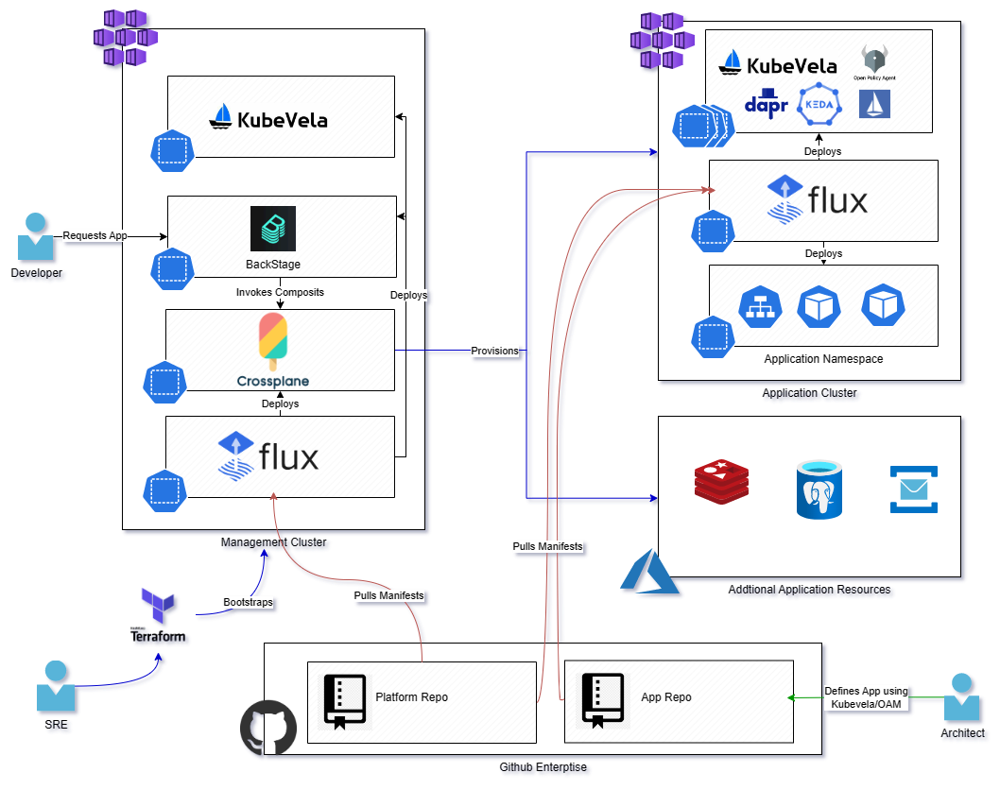

# Overview

This repository is a demonstration of using Crossplane/Upbound in Azure on AKS. It is currently a work in progress

* [Crossplane](https://www.crossplane.io/) is an open source Kubernetes add-on that transforms your cluster into a universal control plane. Crossplane enables platform teams to assemble infrastructure from multiple vendors, and expose higher level self-service APIs for application teams to consume, without having to write any code.
* [Crossplane with Kubevela](https://kubevela.io/docs/platform-engineers/crossplane/)

# Long Term Vision

---

# Prerequisites 
* Azure Subscription
* [Azure Cli](https://github.com/briandenicola/tooling/blob/main/azure-cli.sh)
* [Terraform](https://github.com/briandenicola/tooling/blob/main/terraform.sh)
* [Task](https://github.com/briandenicola/tooling/blob/main/task.sh)
* [Upbound Cli](https://github.com/briandenicola/tooling/blob/main/upbound.sh)

# Quicksteps
## Build Environment
```bash
    az login --scope https://graph.microsoft.com/.default
    task up
    ... Wait til Cluster is Created and Flux has fully reconciled
    task federate-serviceaccount 
```

## Request Azure Resources
```bash
    kubectl apply -f ./claims/ManagedIdentity.yaml #Creates a Resource Group and a couple Managed Identities
    kubectl apply -f ./claims/bjdcontainerapps.yaml #Create Azure Container Apps
    kubectl apply -f ./claims/bjdaks05.yaml #Creates an AKS cluster and deploy an application defined by OAM/Kubevela from ./cluster-configs/workload/httpbin.yaml
```
>> Note: More examples can be found in my [CNCF](https://github.com/briandenicola/cncf/tree/main/crossplane/manifests) project

## Destory Environment
```bash
    az login --scope https://graph.microsoft.com/.default
    task down
```

# Sample Compositions
Compositions | Description
------ | ------
xaksclusters.containers.bjdazure.tech | AKS Cluster deployed to a virtual network with Flux Install
xeventhubs.pubsub.bjdazure.tech | Sample Event Hub Namespace with a single Event Hub
managedidentities.identities.bjdazure.tech | Sample Managed Identity
xvirtualnetworks.networking.bjdazure.tech | Sample Virtual Network
xsillydemoapps.apps.bjdazure.tech  | A demo of XRs of XRs.  This app is made up of a virtual network a managed identity

## Commands
* Additional example [manifests](https://github.com/briandenicola/cncf/tree/main/crossplane)

```bash
    flux get all
    NAME                            REVISION                SUSPENDED       READY   MESSAGE
    gitrepository/cluster-config    main@sha1:ca073f30      False           True    stored artifact for revision 'main@sha1:ca073f30'

    NAME                            REVISION        SUSPENDED       READY   MESSAGE
    helmrepository/daprrepo         sha256:30700e9b False           True    stored artifact: revision 'sha256:30700e9b'
    helmrepository/kubereboot       sha256:fd8bc12e False           True    stored artifact: revision 'sha256:fd8bc12e'
    helmrepository/kubevela         sha256:04ff52ef False           True    stored artifact: revision 'sha256:04ff52ef'
    helmrepository/upbound-stable   sha256:88c9a0e7 False           True    stored artifact: revision 'sha256:88c9a0e7'

    NAME                            REVISION        SUSPENDED       READY   MESSAGE
    helmchart/flux-system-dapr      1.9.5           False           True    pulled 'dapr' chart with version '1.9.5'
    helmchart/flux-system-kured     4.0.2           False           True    pulled 'kured' chart with version '4.0.2'
    helmchart/flux-system-upbound   1.11.3-up.1     False           True    pulled 'universal-crossplane' chart with version '1.11.3-up.1'
    helmchart/flux-system-vela      1.7.2           False           True    pulled 'vela-core' chart with version '1.7.2'

    NAME                    REVISION        SUSPENDED       READY   MESSAGE
    helmrelease/dapr        1.9.5           False           True    Release reconciliation succeeded
    helmrelease/kured       4.0.2           False           True    Release reconciliation succeeded
    helmrelease/upbound     1.11.3-up.1     False           True    Release reconciliation succeeded
    helmrelease/vela        1.7.2           False           True    Release reconciliation succeeded

    NAME                                                    REVISION                SUSPENDED       READY   MESSAGE
    kustomization/cluster-config-addons                     main@sha1:ca073f30      False           True    Applied revision: main@sha1:ca073f30
    kustomization/cluster-config-crossplane-cfg             main@sha1:ca073f30      False           True    Applied revision: main@sha1:ca073f30
    kustomization/cluster-config-crossplane-compositions    main@sha1:ca073f30      False           True    Applied revision: main@sha1:ca073f30

    kubectl get xrds
    NAME                                          ESTABLISHED   OFFERED   AGE
    xaksclusters.containers.bjdazure.tech         True          True      19h
    xeventhubs.pubsub.bjdazure.tech               True          True      16h
    xmanagedidentities.identities.bjdazure.tech   True          True      18h
    xvirtualnetworks.networking.bjdazure.tech     True          True      19h

    kubectl get xmanagedidentities.identities.bjdazure.tech
    NAME                   SYNCED   READY   COMPOSITION            AGE
    bjdapp01-2fxsn-4n5dt   True     True    xmanagedidentity-dev   18h

    kubectl get providerconfig
    NAME                                    AGE
    providerconfig.azure.upbound.io/azure   19h

    NAME                                                                        AGE   CONFIG-NAME   RESOURCE-KIND          RESOURCE-NAME
    providerconfigusage.azure.upbound.io/10b76f95-bbc0-402c-9c7c-2461a7c491b9   18h   azure         Subnet                 bjdapp01-2fxsn-gvbl6
    providerconfigusage.azure.upbound.io/189d472b-663c-43c4-9cae-3b16eb44099a   16h   azure         ResourceGroup          test-pubsub-rg
    providerconfigusage.azure.upbound.io/42bce62c-ef56-4577-bde3-981fd6f9fd39   18h   azure         Subnet                 bjdapp01-2fxsn-tvvd6
    providerconfigusage.azure.upbound.io/5a08f37f-e182-4866-9bc3-b571802696cc   16h   azure         EventHub               bjdhub005-q9fvr-ntjqp
    providerconfigusage.azure.upbound.io/64695c55-2285-4b79-9616-75dd9d3f3128   18h   azure         Subnet                 bjdapp01-2fxsn-gpmrh
    providerconfigusage.azure.upbound.io/665074d2-7185-4fec-ae4f-f5d926b5ca1b   16h   azure         EventHubNamespace      bjdhub005-q9fvr-hpwbl
    providerconfigusage.azure.upbound.io/c0dc0123-132e-45c1-a504-cfe2c6d833be   18h   azure         UserAssignedIdentity   bjdapp01-2fxsn-hhv47
    providerconfigusage.azure.upbound.io/d0290943-5855-42a2-b5a8-f5bfa770f760   18h   azure         VirtualNetwork         bjdapp01-2fxsn-d6zr8
    providerconfigusage.azure.upbound.io/f537b917-e4ab-40de-9469-5059b627fa6c   18h   azure         ResourceGroup          test-app01-rg

    kubectl get providerconfig.azure.upbound.io azure -o yaml
    apiVersion: azure.upbound.io/v1beta1
    kind: ProviderConfig
    metadata:
    creationTimestamp: "2023-05-22T18:43:38Z"
    finalizers:
    - in-use.crossplane.io
    generation: 1
    labels:
        kustomize.toolkit.fluxcd.io/name: cluster-config-crossplane-compositions
        kustomize.toolkit.fluxcd.io/namespace: flux-system
    name: azure
    resourceVersion: "25799"
    uid: 30360285-bcf1-4e8d-98cd-b948c2bbcb5a
    spec:
    clientID: 78698943-b8cc-4171-aa3b-..........
    credentials:
        source: OIDCTokenFile
    subscriptionID: ccfc5dda-43af-4b5e-8cc2-..........
    tenantID: 16b3c013-d300-468d-ac64-..........
    status:
    users: 1
```

## Commands
```bash
    kubectl get environments.containerapp.azure.upbound.io
    NAME       READY   SYNCED   EXTERNAL-NAME   AGE
    bjdcae02   True    True     bjdcae02        4m9s

    kubectl get containerapps.containerapp.azure.upbound.io
    NAME       READY   SYNCED   EXTERNAL-NAME   AGE
    bjdapp01   True    True     bjdapp01        4m11s

    kubectl get xaksclusters.containers.bjdazure.tech  #Creating Cluster
    NAME             SYNCED   READY   COMPOSITION    AGE
    bjdaks05-g97tk   True     False   xcluster-dev   81s

    kubectl get kubernetescluster
    NAME                   READY   SYNCED   EXTERNAL-NAME          AGE
    bjdaks05-g97tk-vqjgw   True    True     bjdaks05-g97tk-vqjgw   18m

    kubectl get xaksclusters.containers.bjdazure.tech
    NAME             SYNCED   READY   COMPOSITION    AGE
    bjdaks05-g97tk   True     True    xcluster-dev   19m

    az aks get-credentials --resource-group bjdaks05-g97tk-frfpb --name bjdaks05-g97tk-vqjgw
    Merged "bjdaks05-g97tk-vqjgw" as current context in /home/brian/.kube/config


```

# Additional References
## Crossplane
* https://docs.crossplane.io/v1.11/concepts/terminology/
* https://docs.crossplane.io/v1.10/cloud-providers/azure/azure-provider/
* https://docs.crossplane.io/v1.11/concepts/composition/
* https://github.com/PacktPublishing/End-to-End-Automation-with-Kubernetes-and-Crossplane/tree/main/Chapter09/Hand-on-examples
* https://marketplace.upbound.io/providers/upbound/provider-azure/
* https://github.com/vfarcic/devops-toolkit-crossplane
## Other
* https://gist.github.com/vfarcic/6d40ff0847a41f1d1607f4df73cd5bad
* https://open-cluster-management.io/
* https://cuelang.org/
* https://www.youtube.com/watch?v=Ii-lpLuzPxw

# Backlog
- [X] Learn Crossplane
- [X] Add GitOps/Kubevela to Workload cluster
- [ ] Add Backstage
- [ ] Update automation to deploy app from Backstage to newly created cluster through Crossplane and Flux
